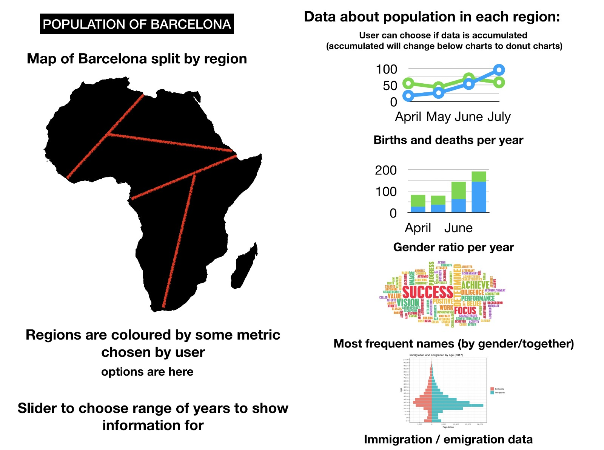

# Data Visualization Project

### How to use the data
The data is loaded into an in-memory NoSQL database for javascript called [loki](http://lokijs.org/). This processes is done in db.js. A global variable is created for the loki database, which can be referenced to as `db`. An example; in order to list all the collections stored in the database we can call anywhere `db.listCollections()`.

Further documentation can be found at https://rawgit.com/techfort/LokiJS/master/jsdoc/index.html. 

### Basic project outline graphic

